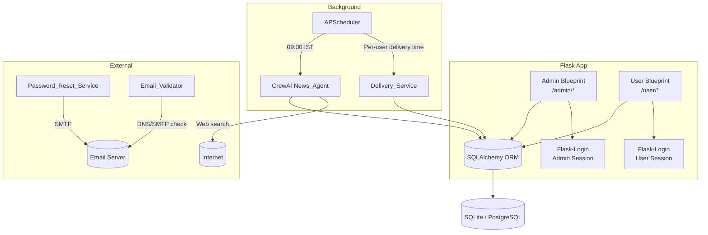
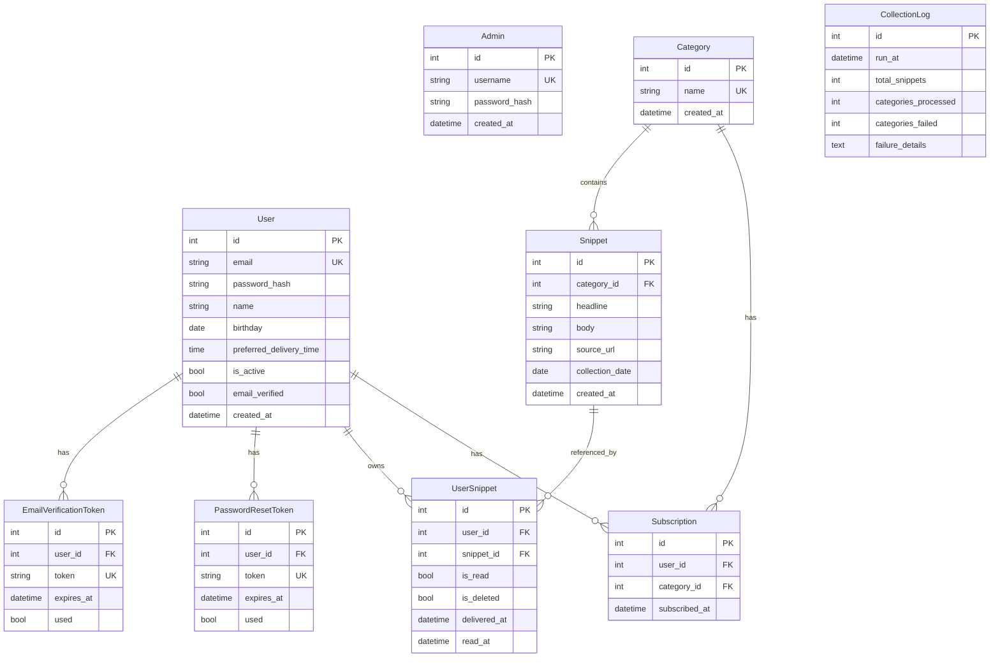

# Design Document: Micro-News App

## Overview

Micro-News is a Flask-based web application that automates daily news collection, summarization, and delivery to subscribed users. The system is structured as a single Flask application with two blueprints — `admin_app` and `user_app` — sharing a common database layer. A CrewAI agent handles autonomous news collection, and APScheduler drives both the daily collection job and per-user delivery jobs.

Key design decisions:
- Single-process Flask app with two blueprints avoids inter-service complexity while maintaining logical separation.
- SQLite for development, PostgreSQL for production (SQLAlchemy abstracts the difference).
- CrewAI's agent/task model maps cleanly onto the search-then-summarize pipeline.
- APScheduler runs in-process, avoiding the need for an external task queue (Celery/Redis) at this scale.
- Bootstrap 5 provides responsive layout with minimal custom CSS.

---

## Architecture



### Request Flow

1. HTTP requests hit the Flask app and are routed to the appropriate blueprint.
2. Flask-Login enforces authentication on protected routes.
3. Background jobs run in a separate APScheduler thread pool within the same process.
4. The CrewAI agent runs synchronously within its scheduled job, writing results to the database.
5. The Delivery_Service job queries the database and flips `UserSnippet.delivered_at` for eligible users.

---

## Components and Interfaces

### Admin Blueprint (`admin_app`)

Handles all admin-facing routes. Mounted at `/admin`.

| Route | Method | Description |
|---|---|---|
| `/admin/login` | GET, POST | Admin login form |
| `/admin/logout` | POST | Invalidate admin session |
| `/admin/dashboard` | GET | Overview: category count, today's collection stats |
| `/admin/categories` | GET | Paginated, alphabetically sorted category list |
| `/admin/categories/new` | POST | Create a new category |
| `/admin/categories/<id>/delete` | POST | Delete category (with confirmation of affected users) |
| `/admin/collection-log` | GET | Paginated collection run history |

### User Blueprint (`user_app`)

Handles all user-facing routes. Mounted at `/`.

| Route | Method | Description |
|---|---|---|
| `/register` | GET, POST | Visitor registration form |
| `/verify/<token>` | GET | Email verification link handler |
| `/login` | GET, POST | User login form |
| `/logout` | POST | Invalidate user session |
| `/dashboard` | GET | Unread count, today's snippets summary |
| `/feed` | GET | Full news feed, grouped by category |
| `/feed/snippets/<id>/read` | POST | Mark snippet as read |
| `/feed/snippets/<id>/delete` | POST | Remove snippet from user's feed |
| `/profile` | GET, POST | View and update profile (name, birthday, delivery time) |
| `/profile/change-password` | POST | Trigger password-reset email |
| `/reset-password/<token>` | GET, POST | Password reset form |
| `/subscriptions` | GET | View all categories with subscription status |
| `/subscriptions/<category_id>/subscribe` | POST | Subscribe to a category |
| `/subscriptions/<category_id>/unsubscribe` | POST | Unsubscribe from a category |

### Email_Validator

Validates email addresses during registration.

```python
class Email_Validator:
    def validate_format(self, email: str) -> bool:
        """RFC 5322 format check via regex."""

    def validate_existence(self, email: str) -> bool:
        """DNS MX record lookup to verify domain exists."""
```

### Password_Reset_Service

Manages password-reset and email-verification token lifecycle.

```python
class Password_Reset_Service:
    def send_reset_link(self, user: User) -> None:
        """Generate a signed token, persist it, send email."""

    def validate_token(self, token: str) -> User | None:
        """Return User if token is valid and not expired, else None."""

    def consume_token(self, token: str, new_password: str) -> bool:
        """Hash and save new password, invalidate token."""
```

### Delivery_Service

Makes collected snippets available in each user's feed at their preferred time.

```python
class Delivery_Service:
    def deliver_for_user(self, user_id: int) -> int:
        """
        Query undelivered UserSnippet rows for user's subscribed categories
        collected today. Set delivered_at = now(). Returns count delivered.
        """
```

### Scheduler

APScheduler configuration with two job types:

```python
# Job 1: Daily news collection at 09:00 IST (UTC+5:30 = UTC+03:30 offset from UTC)
scheduler.add_job(
    run_news_collection,
    trigger=CronTrigger(hour=3, minute=30, timezone='UTC'),  # 09:00 IST
    id='news_collection',
    replace_existing=True
)

# Job 2: Per-user delivery — scheduled dynamically when user sets preferred time
# Each user gets a job keyed by user_id
def schedule_delivery_job(user: User):
    utc_hour, utc_minute = convert_ist_to_utc(user.preferred_delivery_time)
    scheduler.add_job(
        deliver_for_user,
        trigger=CronTrigger(hour=utc_hour, minute=utc_minute, timezone='UTC'),
        id=f'delivery_{user.id}',
        replace_existing=True,
        args=[user.id]
    )
```

### News_Agent (CrewAI)

```python
# Agent definition
news_agent = Agent(
    role='News Researcher',
    goal='Find and summarize recent news articles for a given category',
    backstory='Expert news analyst who writes concise, accurate summaries.',
    tools=[SerperDevTool()]  # or DuckDuckGoSearchRun
)

# Tasks per category
search_task = Task(
    description='Search for the top 10 recent news articles about {category}.',
    agent=news_agent
)

summarize_task = Task(
    description='Summarize each article in 60 words or fewer.',
    agent=news_agent
)

crew = Crew(agents=[news_agent], tasks=[search_task, summarize_task])
```

The collection job iterates over all active categories, runs the crew for each, parses the output into `Snippet` records, and writes a `CollectionLog` entry.

---

## Data Models



### SQLAlchemy Model Notes

- `User.preferred_delivery_time` stores a `time` value in IST; the scheduler converts to UTC when scheduling jobs.
- `UserSnippet` is the per-user view of a snippet. `is_deleted=True` hides it from the feed without deleting the underlying `Snippet`.
- `Snippet.collection_date` (date only) enables efficient querying of "today's snippets".
- `CollectionLog.failure_details` is a JSON-serialized list of `{category, error}` objects.
- Unique constraint on `(user_id, snippet_id)` in `UserSnippet` prevents duplicate delivery.
- Unique constraint on `(user_id, category_id)` in `Subscription` prevents duplicate subscriptions.

---

## Correctness Properties

*A property is a characteristic or behavior that should hold true across all valid executions of a system — essentially, a formal statement about what the system should do. Properties serve as the bridge between human-readable specifications and machine-verifiable correctness guarantees.*


### Property 1: Valid credentials authenticate users

*For any* registered user (admin or regular user) with a known valid username/email and password, submitting those credentials to the login endpoint should result in an authenticated session being established.

**Validates: Requirements 1.1, 5.1**

### Property 2: Invalid credentials are rejected

*For any* credential pair where either the username/email does not exist or the password does not match the stored hash, the login endpoint should return a rejection response and no session should be established.

**Validates: Requirements 1.2, 5.2**

### Property 3: Unauthenticated requests are redirected

*For any* protected route in either the admin or user blueprint, an HTTP request made without a valid session should receive a redirect response (HTTP 302) to the login page rather than the protected content.

**Validates: Requirements 1.3, 5.3**

### Property 4: Inactive sessions are invalidated

*For any* session whose last-activity timestamp is older than the configured timeout (60 minutes for admin, 120 minutes for user), the session should be treated as expired and the user redirected to login.

**Validates: Requirements 1.4, 5.4**

### Property 5: Rate limiting blocks excessive failed logins

*For any* source IP that has accumulated more than 5 consecutive failed login attempts within a 10-minute window, the next login attempt from that IP should be blocked for 15 minutes regardless of credential validity.

**Validates: Requirements 1.5**

### Property 6: Category creation round-trip

*For any* valid category name string, creating a category and then querying the category list should return a category with that name (case-preserved, case-insensitive match).

**Validates: Requirements 2.1**

### Property 7: Duplicate category names are rejected

*For any* existing category name, attempting to create a new category with the same name (in any casing) should be rejected and the total category count should remain unchanged.

**Validates: Requirements 2.2**

### Property 8: Category deletion cascades to snippets

*For any* category with any number of associated snippets, deleting the category should result in both the category record and all its snippet records being absent from the database.

**Validates: Requirements 2.3**

### Property 9: Affected-user count is accurate before deletion

*For any* category with N active subscriptions, the pre-deletion confirmation data should report exactly N affected users.

**Validates: Requirements 2.4**

### Property 10: Category list is alphabetically sorted

*For any* set of categories in the database, the categories endpoint should return them in case-insensitive alphabetical order.

**Validates: Requirements 2.5**

### Property 11: Snippet word count invariant

*For any* snippet stored in the database, the word count of its body field should be less than or equal to 60.

**Validates: Requirements 3.2**

### Property 12: Snippets are associated with their category

*For any* snippet generated during a collection run for a given category, querying snippets by that category should include that snippet.

**Validates: Requirements 3.3**

### Property 13: Collection failure log completeness

*For any* category that fails during a collection run, the resulting CollectionLog failure_details should contain an entry with the category name, a timestamp, and an error reason.

**Validates: Requirements 3.4**

### Property 14: Collection log records run metadata

*For any* completed collection run, the CollectionLog entry should have a non-null run_at timestamp, a non-negative total_snippets count, and accurate categories_processed and categories_failed counts.

**Validates: Requirements 3.5**

### Property 15: Snippet count per category per run is bounded

*For any* category and any single collection run date, the number of snippets with that category_id and that collection_date should be at most 10.

**Validates: Requirements 3.6**

### Property 16: Registration creates a user account

*For any* valid (email, password) pair where the email is not already registered, submitting the registration form should result in a new User record in the database with email_verified=False.

**Validates: Requirements 4.1**

### Property 17: Invalid email formats are rejected

*For any* string that does not conform to RFC 5322 email format, the Email_Validator should return False and registration should be rejected.

**Validates: Requirements 4.2**

### Property 18: Duplicate email registration is rejected

*For any* email address already present in the users table, attempting to register with that same email should be rejected and the user count should remain unchanged.

**Validates: Requirements 4.3**

### Property 19: Weak passwords are rejected

*For any* password string that is shorter than 8 characters, or lacks at least one uppercase letter, one lowercase letter, or one digit, the password validator should return False and registration should be rejected.

**Validates: Requirements 4.4**

### Property 20: Email verification token round-trip

*For any* valid, unexpired EmailVerificationToken, consuming it should set the associated user's email_verified to True and mark the token as used.

**Validates: Requirements 4.5**

### Property 21: Expired tokens are rejected

*For any* token (email verification or password reset) whose expires_at is in the past, the token validation function should return None/False regardless of the token string's validity.

**Validates: Requirements 4.6, 6.7**

### Property 22: Profile fields persist correctly

*For any* logged-in user, updating any profile field (name, birthday, preferred_delivery_time) and then reading the profile should return the updated value.

**Validates: Requirements 6.1, 6.3**

### Property 23: Birthday must be a past date

*For any* date value that is today or in the future, the birthday validation should reject it. For any date value in the past, it should be accepted.

**Validates: Requirements 6.2**

### Property 24: Profile page displays all fields

*For any* user with name, birthday, and preferred_delivery_time set, the profile page response should contain all three values.

**Validates: Requirements 6.4**

### Property 25: Password reset token is created on request

*For any* registered user who requests a password reset, a PasswordResetToken record should be created for that user with a future expires_at.

**Validates: Requirements 6.5**

### Property 26: Password reset token consumption updates password

*For any* valid, unexpired PasswordResetToken and any new password meeting the password policy, consuming the token should update the user's password_hash and mark the token as used=True.

**Validates: Requirements 6.6**

### Property 27: Subscribe/unsubscribe round-trip

*For any* user and category, subscribing then unsubscribing should result in no subscription record existing for that (user_id, category_id) pair — restoring the original state.

**Validates: Requirements 7.1, 7.2**

### Property 28: Category list reflects subscription status

*For any* user, the categories listing should include every category in the database, and each category's subscription indicator should accurately reflect whether a Subscription row exists for that (user_id, category_id) pair.

**Validates: Requirements 7.3**

### Property 29: Delivery sets delivered_at on all eligible snippets

*For any* user with subscriptions and undelivered UserSnippet rows for today's collection, running deliver_for_user should set a non-null delivered_at on every eligible row and return the correct count.

**Validates: Requirements 8.1, 8.4**

### Property 30: No delivery when no snippets available

*For any* user where no undelivered UserSnippet rows exist for today's collection date, running deliver_for_user should update zero rows.

**Validates: Requirements 8.3**

### Property 31: Mark-as-read is user-scoped

*For any* user marking a snippet as read, the UserSnippet.is_read for that user should become True, while other users' UserSnippet rows for the same snippet should remain unaffected.

**Validates: Requirements 9.1**

### Property 32: Snippet deletion is user-scoped

*For any* user deleting a snippet from their feed, the UserSnippet.is_deleted for that user should become True, while other users' UserSnippet rows for the same snippet should remain unaffected.

**Validates: Requirements 9.2**

### Property 33: Feed ordering puts unread before read

*For any* user's feed query, within each category section, all UserSnippet rows with is_read=False should appear before all rows with is_read=True.

**Validates: Requirements 9.3**

### Property 34: Unread count matches database state

*For any* user, the unread count returned by the dashboard query should equal the number of UserSnippet rows for that user where is_read=False, is_deleted=False, and delivered_at is not null.

**Validates: Requirements 9.4**

### Property 35: Bootstrap is idempotent when admin exists

*For any* database state where at least one Admin record exists, running the bootstrap function should not create any additional Admin records, regardless of environment variable values.

**Validates: Requirements 10.3**

---

## Error Handling

### Authentication Errors
- Invalid credentials: return HTTP 401 with a generic "Invalid username or password" message (no field-specific hints).
- Session expired: return HTTP 302 redirect to login with a flash message.
- Rate limit exceeded: return HTTP 429 with a "Too many attempts, try again in 15 minutes" message.

### Validation Errors
- Form validation failures (email format, password policy, duplicate email): return HTTP 422 with field-level error messages rendered in the form.
- Birthday in the future: return HTTP 422 with "Birthday must be a date in the past."

### Token Errors
- Expired or already-used verification/reset tokens: return HTTP 400 with a message explaining the token is invalid and offering to request a new one.
- Missing token: return HTTP 404.

### News Collection Errors
- Per-category failures: logged to `CollectionLog.failure_details`; the job continues processing remaining categories.
- Complete job failure (e.g., scheduler crash): APScheduler logs the exception; the next scheduled run will attempt collection again.
- CrewAI API errors: caught within the collection job, logged, and treated as a per-category failure.

### Database Errors
- Unique constraint violations (duplicate category, duplicate subscription): caught at the service layer and returned as validation errors to the caller.
- Connection errors: Flask's error handler returns HTTP 500 with a generic error page; errors are logged with full stack traces.

### Startup Errors
- Missing `ADMIN_USERNAME` or `ADMIN_PASSWORD` env vars with no existing admin: log a `CRITICAL` level message and raise `SystemExit(1)` to halt the process.

---

## Testing Strategy

### Dual Testing Approach

Both unit tests and property-based tests are required. They are complementary:
- Unit tests cover specific examples, integration points, and edge cases.
- Property-based tests verify universal correctness across randomized inputs.

### Unit Tests

Focus areas:
- Email_Validator: specific valid and invalid email examples.
- Password policy: boundary examples (exactly 8 chars, missing uppercase, etc.).
- Admin bootstrapping: example-based tests for the three startup scenarios (no admin + env vars present, no admin + env vars missing, admin already exists).
- Default delivery time (10:00 IST) when preferred_delivery_time is null.
- CollectionLog creation after a run with mixed success/failure.
- Token expiry boundary: token expiring exactly at the current time.

### Property-Based Tests

**Library**: `hypothesis` (Python)

Each property-based test must run a minimum of 100 iterations (Hypothesis default is 100; set `@settings(max_examples=100)` explicitly).

Each test must be tagged with a comment in the format:
`# Feature: micro-news-app, Property {N}: {property_text}`

Each correctness property listed above must be implemented by exactly one property-based test. The test generates random inputs using Hypothesis strategies and asserts the property holds.

Example structure:
```python
from hypothesis import given, settings, strategies as st

# Feature: micro-news-app, Property 11: Snippet word count invariant
@given(st.text(min_size=1))
@settings(max_examples=100)
def test_snippet_word_count_invariant(article_text):
    snippet = summarize(article_text)
    assert len(snippet.split()) <= 60
```

Key strategy notes:
- Use `st.emails()` for email generation (covers RFC 5322 edge cases).
- Use `st.text()` with alphabet filters for password generation.
- Use `st.dates(max_value=date.today() - timedelta(days=1))` for valid birthdays.
- Use `st.datetimes(max_value=datetime.utcnow() - timedelta(hours=1))` for expired token timestamps.
- Use `st.lists(st.text())` for category name sets to test ordering properties.
- Database-touching tests should use a fresh in-memory SQLite instance per test via a pytest fixture.
